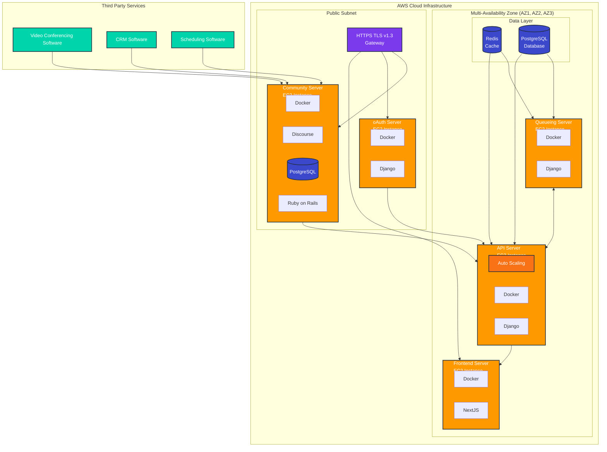

# MindYou System Architecture

## Mermaid Architecture Diagram



---

## Architecture Overview

The **MindYou System Architecture** is a cloud-native, highly available application infrastructure deployed on **Amazon Web Services (AWS)**. The system is designed with a multi-layered approach that separates concerns between public-facing services, internal API processing, and external third-party integrations.

### Key Design Principles

1. **High Availability**: Multi-availability zone deployment ensures redundancy and fault tolerance
2. **Scalability**: Auto-scaling capabilities on API servers to handle variable load
3. **Security**: HTTPS TLS v1.3 encryption for all external communications
4. **Containerization**: Docker-based deployment for consistency and portability
5. **Service Separation**: Clear boundaries between frontend, backend, authentication, and community services

---

## Components Breakdown

### 1. Multi-Availability Zone Infrastructure

The core application infrastructure is distributed across multiple AWS availability zones (AZ1, AZ2, AZ3) to ensure high availability and disaster recovery capabilities.

#### Data Layer

**Redis (Cache)**
- In-memory data store for high-speed caching
- Reduces database load and improves response times
- Stores session data, frequently accessed content, and temporary data
- Connected to both Queueing and API servers

**PostgreSQL (Database)**
- Primary relational database for persistent data storage
- Stores user data, application state, and business logic
- Provides ACID compliance for transactional integrity
- Accessed by both Queueing and API servers

#### Queueing Server (EC2 Instance)

**Purpose**: Handles asynchronous job processing and background tasks

**Technology Stack**:
- **Docker**: Containerization platform for consistent deployment
- **Django**: Python web framework for backend logic

**Responsibilities**:
- Process background jobs and scheduled tasks
- Handle email notifications, data processing, and batch operations
- Decouple long-running operations from user-facing requests
- Communicate with Redis for job queue management
- Access PostgreSQL for data persistence

#### API Server (EC2 Instance with Auto Scaling)

**Purpose**: Core business logic and API endpoint management

**Technology Stack**:
- **Docker**: Container runtime environment
- **Django**: RESTful API framework
- **Auto Scaling**: Dynamic instance scaling based on load metrics

**Responsibilities**:
- Serve RESTful API endpoints for client applications
- Handle business logic and data validation
- Integrate with authentication services (oAuth)
- Scale horizontally based on traffic demands
- Process requests from Frontend, Community, and oAuth servers
- Manage database transactions and cache operations

#### Frontend Server (EC2 Instance)

**Purpose**: User interface and client-side application delivery

**Technology Stack**:
- **Docker**: Container environment
- **NextJS**: React-based server-side rendering framework

**Responsibilities**:
- Serve the web application interface
- Server-side rendering for improved performance and SEO
- Handle client-side routing and state management
- Communicate with API server for data operations
- Deliver static assets and optimized bundles

---

### 2. Public Subnet Infrastructure

The public subnet contains services that are directly accessible from the internet through secure gateways.

#### HTTPS TLS v1.3 Gateway

**Purpose**: Secure entry point for all external traffic

**Security Features**:
- TLS v1.3 encryption for data in transit
- SSL certificate management
- DDoS protection and rate limiting
- Load balancing across backend services

**Routing**:
- Routes traffic to Community Server
- Routes traffic to oAuth Server
- Routes traffic to Frontend Server

#### Community Server (EC2 Instance)

**Purpose**: Community engagement and forum functionality

**Technology Stack**:
- **Docker**: Containerization
- **Discourse**: Open-source discussion platform
- **PostgreSQL**: Dedicated database for community data
- **Ruby on Rails**: Web application framework

**Responsibilities**:
- Host community forums and discussions
- User-generated content management
- Integration with third-party services (Video Conferencing, CRM, Scheduling)
- User engagement features (posts, comments, reactions)
- Communication with main API server for user authentication and data sync

**Integrations**:
- **Video Conferencing Software**: Enable virtual meetings and webinars
- **CRM Software**: Sync customer relationship data
- **Scheduling Software**: Manage appointments and events

#### oAuth Server (EC2 Instance)

**Purpose**: Authentication and authorization service

**Technology Stack**:
- **Docker**: Container runtime
- **Django**: OAuth2 provider implementation

**Responsibilities**:
- User authentication and identity management
- OAuth2 token generation and validation
- Single Sign-On (SSO) capabilities
- Session management and user authorization
- Secure credential storage
- API authentication for internal services

---

## Data Flows and Interactions

### 1. User Access Flow

```
User → HTTPS Gateway → Frontend Server → API Server → Database/Cache
```

1. User accesses the application through a web browser
2. Request passes through HTTPS TLS v1.3 Gateway for security
3. Gateway routes to Frontend Server (NextJS)
4. Frontend renders the UI and makes API calls
5. API Server processes requests and returns data
6. Response flows back through the chain to the user

### 2. Authentication Flow (oAuth)

```
User → HTTPS Gateway → oAuth Server → API Server → Frontend Server
```

1. User initiates login from Frontend
2. Request routed to oAuth Server through Gateway
3. oAuth Server validates credentials
4. Token generated and returned to Frontend
5. Frontend stores token for subsequent API requests
6. API Server validates token with oAuth Server for protected endpoints

### 3. API Request Flow

```
Frontend/External Client → API Server → Redis/PostgreSQL → Response
```

1. Client sends authenticated request to API Server
2. API Server checks Redis cache for data
3. If cache miss, queries PostgreSQL database
4. Business logic processing occurs
5. Response cached in Redis (if applicable)
6. Response returned to client

### 4. Background Job Flow

```
API Server → Redis Queue → Queueing Server → PostgreSQL
```

1. API Server enqueues background job to Redis
2. Queueing Server picks up job from Redis queue
3. Job processing executes (email, data processing, etc.)
4. Results stored in PostgreSQL
5. Status updates published to Redis
6. API Server notified of job completion

### 5. Community Interaction Flow

```
Third-Party Services → Community Server → API Server → Main Database
```

1. External services (Video, CRM, Scheduling) integrate with Community Server
2. Community Server processes events and user interactions
3. Relevant data synchronized with main API Server
4. User data and engagement metrics stored in main database
5. Community-specific data stored in Community Server's PostgreSQL

### 6. Third-Party Integration Flow

```
Scheduling/CRM/Video Software → Community Server → API Server
```

1. Third-party services send webhooks or API calls to Community Server
2. Community Server processes external events
3. Data transformed and forwarded to API Server
4. Main application updated with external service data
5. Users see integrated information across platforms

---

## Infrastructure Layers

### Layer 1: External Services Layer
- Third-party integrations (Video Conferencing, CRM, Scheduling)
- External API consumers
- End-user browsers and mobile applications

### Layer 2: Security and Gateway Layer
- HTTPS TLS v1.3 Gateway
- SSL termination
- DDoS protection
- Rate limiting and traffic management

### Layer 3: Public Services Layer (Public Subnet)
- Community Server: User engagement and forums
- oAuth Server: Authentication and authorization
- Publicly accessible services with controlled access

### Layer 4: Application Layer (Multi-AZ)
- Frontend Server: User interface delivery
- API Server: Business logic and data processing
- Queueing Server: Background job processing

### Layer 5: Data Layer (Multi-AZ)
- Redis: High-speed caching and session storage
- PostgreSQL: Persistent data storage and relational data

---

## Security Features

### 1. Transport Layer Security
- **HTTPS TLS v1.3**: Latest encryption standard for all external communications
- End-to-end encryption between client and server
- Certificate-based authentication

### 2. Network Isolation
- **Public Subnet**: Limited services exposed to internet
- **Private Network**: Internal services communicate within AWS VPC
- Security groups and network ACLs control traffic flow

### 3. Authentication and Authorization
- **oAuth 2.0**: Industry-standard authentication protocol
- Token-based authentication for stateless API access
- Centralized authentication service for all applications

### 4. Containerization Security
- **Docker**: Isolated container environments
- Container image scanning for vulnerabilities
- Minimal attack surface with purpose-built containers

---

## Scalability and Performance

### 1. Auto Scaling
- **API Server**: Automatically scales based on CPU, memory, or request metrics
- Horizontal scaling adds instances during high traffic
- Scales down during low usage to optimize costs

### 2. Caching Strategy
- **Redis**: Reduces database load by 70-90%
- Stores frequently accessed data in memory
- Session management and temporary data storage
- Cache invalidation strategies for data consistency

### 3. Multi-Availability Zone Deployment
- **Redundancy**: Services deployed across multiple zones
- **Fault Tolerance**: Automatic failover if one zone fails
- **Load Distribution**: Traffic distributed across zones

### 4. Database Optimization
- **PostgreSQL**: Optimized queries and indexing
- Connection pooling for efficient database access
- Read replicas for scaling read operations (potential enhancement)

### 5. Asynchronous Processing
- **Queueing Server**: Offloads time-consuming tasks
- Non-blocking operations improve user experience
- Retry mechanisms for failed jobs

---

## Technology Stack Summary

| Component | Technologies |
|-----------|-------------|
| **Frontend** | NextJS, React, Docker |
| **API Backend** | Django, Python, Docker |
| **Authentication** | Django OAuth Toolkit, Docker |
| **Community Platform** | Discourse, Ruby on Rails, Docker |
| **Background Jobs** | Django, Python, Docker |
| **Databases** | PostgreSQL (multiple instances) |
| **Cache** | Redis |
| **Container Orchestration** | Docker |
| **Cloud Provider** | AWS (EC2, Auto Scaling, VPC) |
| **Security** | HTTPS TLS v1.3, OAuth 2.0 |
| **Third-Party Integrations** | Video Conferencing, CRM, Scheduling APIs |

---

## System Benefits

### 1. High Availability
- Multi-AZ deployment ensures 99.9%+ uptime
- Automatic failover capabilities
- No single point of failure

### 2. Scalability
- Auto-scaling handles traffic spikes automatically
- Horizontal scaling for cost-effective growth
- Containerized architecture simplifies scaling

### 3. Security
- Industry-standard encryption (TLS v1.3)
- OAuth 2.0 authentication
- Network isolation and security groups
- Regular security updates via container images

### 4. Performance
- Redis caching for sub-millisecond response times
- CDN-ready NextJS frontend
- Optimized database queries
- Asynchronous processing for long-running tasks

### 5. Maintainability
- Docker containers ensure consistency across environments
- Clear separation of concerns
- Microservices-like architecture
- Easy to update and deploy individual components

### 6. Integration Flexibility
- RESTful APIs for easy integration
- OAuth for third-party authentication
- Webhooks for real-time updates
- Support for various external services

---

## Future Enhancements

### Potential Improvements

1. **Kubernetes Migration**: Move from standalone Docker to Kubernetes for advanced orchestration
2. **Microservices Architecture**: Further decompose API server into domain-specific services
3. **CDN Integration**: Add CloudFront or similar CDN for global content delivery
4. **Database Replication**: Implement read replicas for PostgreSQL to scale read operations
5. **Message Queue**: Add RabbitMQ or AWS SQS for more robust queue management
6. **Monitoring and Observability**: Implement Prometheus, Grafana, or AWS CloudWatch
7. **CI/CD Pipeline**: Automate testing and deployment with GitHub Actions or GitLab CI
8. **API Gateway**: Add AWS API Gateway for advanced routing and throttling
9. **Serverless Components**: Migrate some background jobs to AWS Lambda
10. **Multi-Region Deployment**: Expand beyond single region for global availability

---

## Conclusion

The MindYou System Architecture represents a well-designed, modern cloud-native application infrastructure. It balances security, scalability, and performance while maintaining clear separation of concerns. The multi-layered approach with distinct zones for public services, application logic, and data storage provides both flexibility and security.

The use of containerization (Docker), modern frameworks (Django, NextJS, Discourse), and AWS services creates a robust foundation for a scalable SaaS application. The architecture supports both synchronous user interactions and asynchronous background processing, making it suitable for complex business applications with diverse requirements.

With proper monitoring, automated deployment, and continued optimization, this architecture can support significant growth while maintaining high availability and performance standards.
