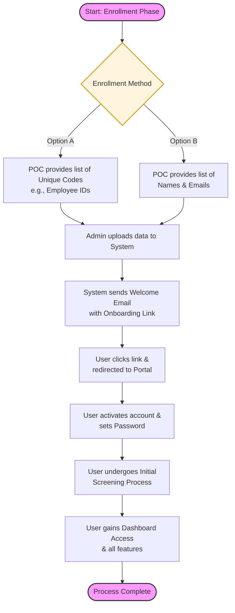

# Enrollment Process / Onboarding

## 🌟 Key Highlights of This Enrollment Flow

- **Flexibility at the Start:**  
  Whether the company provides pre-existing IDs or a fresh email list, the **Upload** step unifies the process—making onboarding easy regardless of source data.

- **Security by Design:**  
  Users are prompted to set their own password upon first login, ensuring that unique identifiers (like Employee IDs) aren't the sole means of account protection.

- **Gatekeeping & Controlled Access:**  
  The **Initial Screening** step acts as a safeguard. Even after activating their account, users gain full dashboard access only after completing your specific onboarding requirements.

