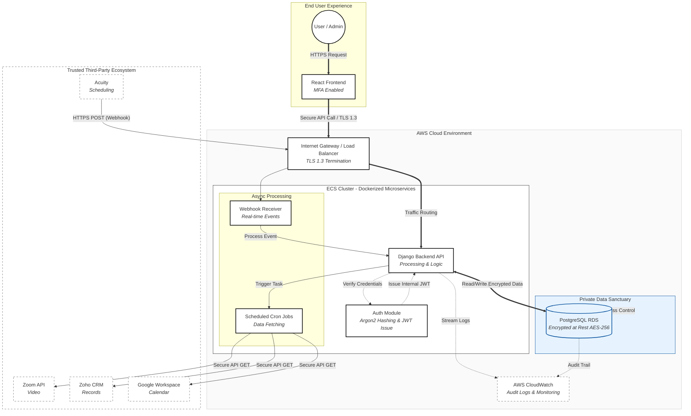

# Hot Leads for Tony and Rob

> **Narrating the Diagram for a Non-Technical Audience**

### 🔒 The Secure Handshake (Top Layer)
- **User → React Frontend:**  
  The user starts by interacting with a React website, where Multi-Factor Authentication (MFA) is always required for security.
- **Secure Communication:**  
  All data travels across the public internet in a _tamper-proof tunnel_ (TLS 1.3), making it impossible for outsiders to intercept sensitive information like booking or mood data.

---

### 🧠 The Brain (Middle Layer – ECS/Django)
- **Central Orchestrator:**  
  At the core sits the Django backend, which coordinates everything behind the scenes.
- **Internal Security:**  
  Even inside the cloud, services never trust each other blindly. The “Auth Module” hands out special digital passes (Internal JWTs), so even if one part is compromised, the rest of the system stays safe.

- **Data Processing:**
  - **Scheduled Tasks (Cron Jobs – Outbound):**  
    The system _wakes up_ on a schedule to fetch attendance data or update calendars by reaching out to Zoom, Zoho, or Google.
  - **Webhooks (Inbound):**  
    When real-time events happen (like a patient cancels via Acuity), Acuity sends an instant alert to your system, which is quickly processed so the records are always current.

---

### 🏦 The Vault (Bottom Layer – Storage)
- **Private Data Sanctuary:**  
  The PostgreSQL database is set apart in a blue “trust zone.” It can *only* talk to the Django backend—never directly to the internet.  
  Even if someone physically stole a hard drive, all data is encrypted (AES-256) and completely unreadable without the proper keys.

---

### 📝 Audit & Compliance (Right Side)
- **Footprints for Compliance:**  
  Every action—logins, bookings, data fetches—leaves a trace in CloudWatch (indicated by dotted lines).  
  This constant logging keeps the system compliant with standards like ISO 27001 and provides a clear audit trail.

---

