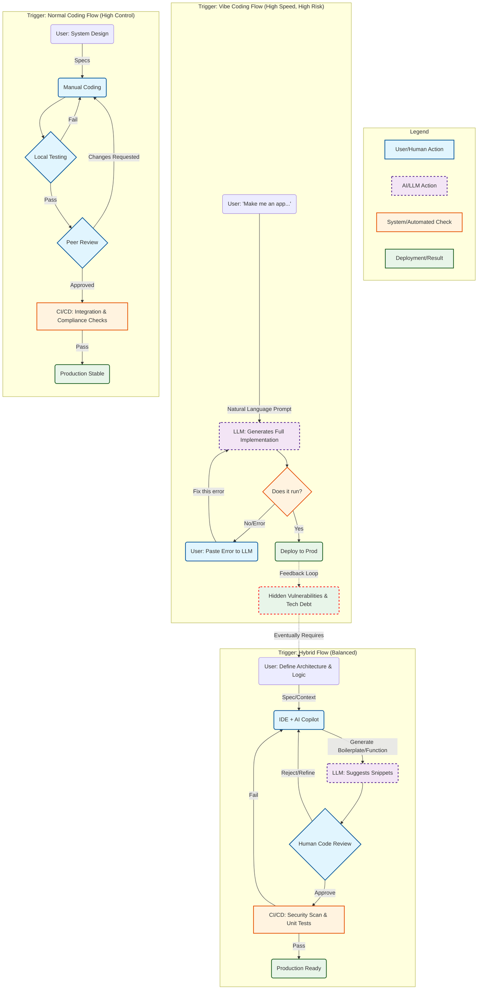

# Architectural Differences: Vibe Coding vs. Hybrid Coding vs. Normal Coding

This document compares Vibe Coding (LLM-driven/prompt-driven), Hybrid Coding (AI-assisted), and Normal Coding (traditional) in terms of philosophy, risk, quality, and process. Insights are based on developer surveys (e.g., Stack Overflow, GitHub Octoverse) and security reports (e.g., Unit 42, OWASP LLM Top 10).

## Part 1: Comparative Criteria

| **Criteria**            | **Vibe Coding (Pure AI / Prompt-Driven)** | **Hybrid Coding (AI as Copilot)** | **Normal Coding (Human-Authored)** |
|-------------------------|-------------------------------------------|-------------------------------------|------------------------------------|
| **Core Philosophy**     | *Outcome over Syntax* Focus on end result. Developer may not understand the code details. | *Augmented Intelligence* AI speeds up repetitious coding. Human reviews and owns all code. | *Determinism & Control* Every line is crafted. System understanding and optimization are key. |
| **Security Posture**    | High Risk ~62% of AI code contains vulnerabilities; often ignores edge cases. | Medium Risk AI may suggest insecure code, but humans should catch errors. | Low Risk (Context Dependent) Security patterns like Defense in Depth are common. |
| **Compliance & Legal**  | Gray Zone / Shadow AI High leakage/IP risks. Data may be sent to public LLMs. | Managed Compliance Enterprise AI use. Risks mitigated via human review and modification. | Strict Compliance No third-party data sharing. Clear license/copyright. |
| **Code Quality & Debt** | "Spaghetti that Works" High debt, inconsistent naming, hallucinated code. Maintenance is tough. | Refined & Standardized AI fits project patterns if context is set; human ensures readability. | Maintainable Modularity, DRY, and long-term integrity are prioritized. |
| **Integration Capacity**| Low (Greenfield Only) Struggles with legacy and full-stack context. | High AI helps with syntax/new code, human handles legacy integration. | High Humans manage complex, undocumented systems. |
| **DevOps & Deploy**     | Fragile / Magic Relies on "it runs on my machine." Testing is often skipped. | Accelerated AI generates scaffolds, humans tune for production. | Robust CI/CD pipelines and infrastructure closely reviewed. |

---

## Part 2: Architectural Process Diagram

Below is a Mermaid flowchart visualizing the three workflows. "Danger Zone" (Vibe Coding) means bypassing understanding; "Review Gate" is present in Hybrid/Normal flows.

---

## Key Takeaways

**Vibe Coding (AI Loop)**
- Fast but risky: The user copies errors into the LLM and applies iterative "brute force" fixes without understanding the implementation.
- Tends toward "code bloat" and layering of shallow fixes on top of each other.

**Hybrid Coding**
- Human is the architect/editor. The process includes a code review gate before CI/CD.
- Catches logic errors AI/syntax checkers often miss. Balances speed and safety.

**Normal Coding**
- Peer review and upfront system design are built-in, trading off speed for stability.
- Most robust for integration and legacy systems.

---

### Integration and Legacy Context

- **Existing Projects:** Vibe coding is unsuited for legacy due to lack of whole-repo awareness. It may duplicate code or break dependencies.
- **Hybrid Tools:** Indexing/codebase context in AI tools (e.g., Cursor, Copilot Workspace) partially mitigate this but have limitations.
- **Normal Coding:** Remains safest and most reliable for complex refactoring in production legacy systems.
