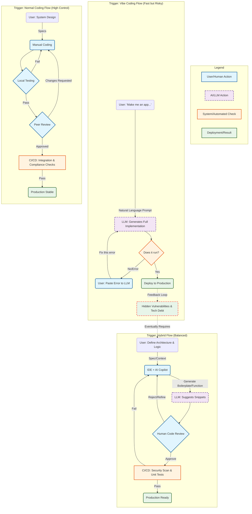

# Comparative Analysis: Vibe Coding, Hybrid Coding, and Normal Coding

This document provides an in-depth comparison of three distinct software development methodologies: **Vibe Coding** (fully AI-driven and prompt-based), **Hybrid Coding** (AI-enhanced with human oversight), and **Normal Coding** (traditional, human-authored development). Based on developer surveys and security reports (e.g., Stack Overflow, GitHub Octoverse, Unit 42, OWASP LLM Top 10), we outline the core differences in philosophy, risk, quality, and process.

---

## Part 1: Methodology Comparison

The table below highlights the key distinctions in approach, risk, and results among Vibe Coding, Hybrid Coding, and Normal Coding.

| **Criteria**            | **Vibe Coding (Pure AI / Prompt-Driven)**    | **Hybrid Coding (AI as Copilot)**          | **Normal Coding (Human-Authored)**         |
|-------------------------|----------------------------------------------|--------------------------------------------|-------------------------------------------|
| **Core Philosophy**     | *Outcome over Syntax* Focuses on results, often bypassing detailed understanding of the code. | *Augmented Intelligence* AI assists repetitive tasks, but humans retain control and ownership. | *Determinism and Control* Every line is manually crafted, focusing on optimization and precision. |
| **Security Posture**    | High Risk ~62% of AI-generated code contains potential vulnerabilities; edge cases are frequently overlooked. | Medium Risk AI may suggest insecure patterns, but human oversight helps mitigate risks. | Low Risk Adheres to best practices like Defense in Depth and secure architecture. |
| **Compliance & Legal**  | Gray Zone High risks of intellectual property (IP) leakage and compliance challenges when using public LLMs. | Managed Compliance AI suggestions are reviewed and modified to align with legal and enterprise compliance norms. | Strict Compliance No external data sharing; adheres to stringent licensing and copyright practices. |
| **Code Quality & Debt** | "Spaghetti that Works" High technical debt and maintenance challenges due to inconsistency and hallucinated code. | Refined and Standardized AI assists with context-based refinements; humans enforce readability and maintainability. | High Maintainability Prioritizes modularity, DRY principles, and integrity for long-term sustainability. |
| **Integration Capacity**| Low Better suited for greenfield projects; struggles with legacy or full-stack context. | High Combines AI efficiency for new code with human expertise for complex integrations. | High Best suited for legacy and undocumented systems. |
| **DevOps and Deployment**| Fragile Often lacks automated testing; may deploy unoptimized "it works on my machine" code. | Balanced AI generates foundational code; humans ensure production readiness. | Robust Code is comprehensively tested and integrated into CI/CD pipelines for reliable deployment. |

---

## Part 2: Workflow Visualization

The following flowchart illustrates the distinct workflows for each methodology, highlighting common risks, gates, and practices.

### Mermaid Diagram

---

## Key Takeaways

### **Vibe Coding (AI-Driven Development)**

- Strengths:
  - Extremely fast development of prototypes and greenfield projects.
- Weaknesses:
  - High risks of vulnerabilities and unmaintainable technical debt.
  - Minimal human understanding of code logic.

### **Hybrid Coding (AI-Augmented Approach)**

- Strengths:
  - Balances speed with accuracy and production-readiness.
  - Incorporates human reviews to improve code quality and reduce logic errors.
- Weaknesses:
  - Still somewhat dependent on proper AI setup and debugging.

### **Normal Coding (Traditional Approach)**

- Strengths:
  - Most stable and secure for critical systems and integrations.
  - High maintainability, with long-term focus on modularity and efficiency.
- Weaknesses:
  - Slower development process.
  - Requires greater technical expertise and time investment upfront.

---

## Recommendations

### For New Projects
- Vibe Coding is suitable for rapid prototyping but should transition to Hybrid or Normal Coding for production.

### For Existing/Legacy Projects
- Hybrid or Normal Coding is better suited, particularly for complex integrations and refactoring.

This comparative analysis highlights the need to align coding methodology with project goals, complexity, and risk tolerance.