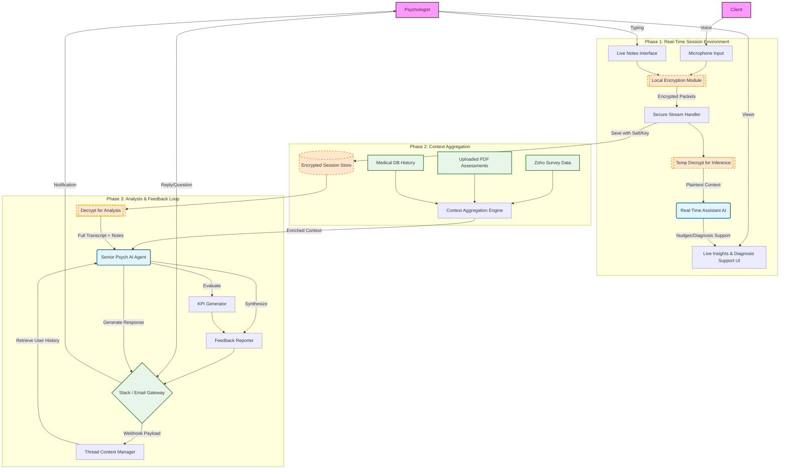

# Real-Time Session Helpers

This document provides a comprehensive architecture for a **real-time session helper** designed to enhance communication between psychologists and clients. The system employs AI-powered session assistance, context aggregation, and secure data handling to support live sessions, data storage, and post-processing workflows.

---

## Overview of Workflow Architecture

The workflow is broken into three key phases:
1. **Real-Time Session Environment**: Live session tools to facilitate communication and provide AI-driven insights in real time.
2. **Context Aggregation**: Secure storage and contextual data processing for enhanced insights.
3. **Analysis & Feedback**: Post-session processing that generates actionable insights and facilitates follow-up communication.

To visualize the architecture, a **Mermaid flowchart** is included below.

---

## Mermaid Diagram: Session Helpers Workflow

The following flowchart illustrates the three phases of the session helper:

---

## Detailed Phase Breakdown

### **Phase 1: Real-Time Session Environment**

This phase enables real-time communication between the psychologist and the client with AI assistance:

- **Actors**:
  - **Psychologist**: Enters notes and views AI-generated live insights via the Suggestion UI.
  - **Client**: Provides input through a microphone.
- **Live Encryption/Decryption**:
  - Voice inputs and live notes pass through a **Local Encryption Module** and **Secure Stream Handler**, ensuring data security.
  - A **Decryption Stream** temporarily processes data for real-time AI analysis.
- **AI Functionality**:
  - The **Real-Time Assistant AI** processes plaintext data to provide nudges and diagnosis suggestions.
  - Outputs are displayed through the **Live Insights & Diagnosis Support UI**.

### **Phase 2: Context Aggregation**

In this phase, data from real-time sessions is securely stored and combined with external information for future analysis:

- **Encrypted Storage**:
  - All session inputs are securely stored using **salts/keys** within an **Encrypted Session Store**.
- **External Data Sources** (integrated via the Context Aggregation Engine):
  - **Zoho Survey Data**: Client-submitted survey results.
  - **Uploaded PDFs**: Assessments and documentation.
  - **Medical DB History**: Historical medical data from external systems.
- **Context Aggregation Engine**:
  - Aggregates and enriches all session, survey, and historical data for deeper insights.

### **Phase 3: Post-Processing**

This phase applies advanced AI for analysis, reporting, and feedback:

- **Decryption & Analysis**:
  - Session data is decrypted for analysis by the **Senior Psych AI Agent**.
- **KPI and Report Generation**:
  - The Senior AI evaluates session data to generate Key Performance Indicators (KPIs) and other metrics.
  - Synthesizes insights into a comprehensive feedback report.
- **Communication Loop**:
  - Feedback is shared with the psychologist through communication channels (e.g., Slack or Email).
  - A **Thread Context Manager** ensures smooth backward compatibility and context retrieval for ongoing discussions.

---

This document defines a holistic session helper workflow, emphasizing data security, live AI assistance, and effective post-session analysis to improve outcomes and client care. It demonstrates how modern tools like encryption, data aggregation, and AI agents can enhance real-time and post-session processes.