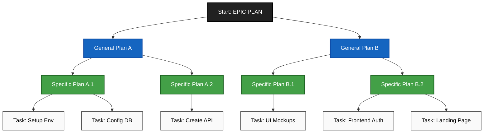

# How to start:

# Reference Prompts for AI Agents (Django, Celery, DRF)

## Architecture Sanity Before You Code
"Read @file:docs/api.md and the `urls.py` files in each Django app. List 3–5 design risks (coupling, caching, auth). For each, show the minimal change that reduces risk and link to lines by @file#line. Return a prioritized plan and an estimate of touched files."

*Why it works:* scopes the assistant to concrete files + a small, ranked plan. Review diffs in the VS Code panel before applying.

## API Contract → Server + Client Glue
"From @file:api/users/openapi.yaml, generate Django REST Framework serializers and viewsets, and a typed client. Include validation, error mapping, and tests. Keep each change in a separate patch."

*Keeps PRs readable:* pair with a slash command like `/api-from-openapi users`.

## DB Migration with Guardrails
"Audit `users/migrations/0001_initial.py` for encoding, indexing, and rollback risks. If safe, propose a patch; else output a checklist. Generate a verification script that samples rows and asserts invariants."

*Store this as* `/scan-migration`. I approve the verification script first, then the patch.

## Security Pass (Fast)
"Run a security review on the current diff. Flag auth boundaries (e.g., `permissions.py`, custom authentication classes), cookie/CSRF settings, header parsing, and secret exposure. Provide line-anchored fixes with rationale."

*Note:* There’s also an official security reviewer and GitHub Action if you want CI comments on PRs with suggested remediations.

## Tests That Pay Rent
"Given changes in `payments/` (e.g., `models.py`, `views.py`, `tasks.py`), propose table-driven tests that cover nulls, timeouts, idempotency, and retries for both synchronous and Celery asynchronous operations. Prefer failing first, then provide patches to make them pass."

*Bundle as* `/write-tests payments`.

## Perf Triage Without Yolo Optimizations
"Profile the hot path in `orders/views.py` or a critical Celery task in `orders/tasks.py`. Identify 2 bottlenecks with line refs, estimate complexity, and propose the smallest safe improvement. Don’t micro-optimize; aim for p95 wins."

## Frontend Event Hygiene
"Scan modified React components. Ensure analytics events map to @file:analytics/events.md. Generate a diff to add missing events and assert payload shapes in tests."

## PR Ready-to-Merge Summary
"Summarize this PR in 5 bullets: problem, approach, risks, tests, rollout. If risky, suggest a feature flag and rollback plan."