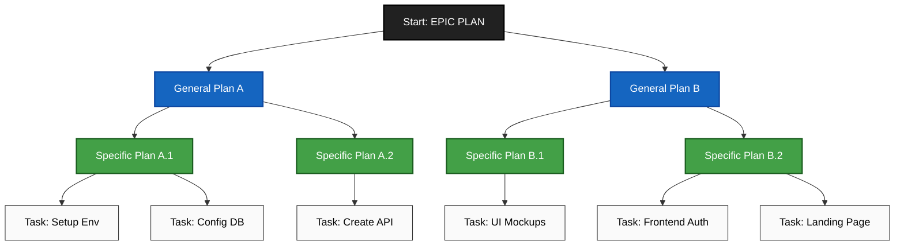

# Reference Prompts for AI Agents

This document presents workflows, prompts, and guidelines designed to optimize the use of AI agents in software development. These examples are targeted at applications involving Django, Celery, Django REST Framework (DRF), and related technologies. It also includes a visual plan diagram for starting projects effectively.

---

## How to Start a Project

Below is a high-level visual workflow using a mermaid diagram to help you break down tasks and align your plans efficiently:

---

## Core Prompts and Best Practices

The following prompts are designed for specific scenarios to maximize efficiency and accuracy in development workflows.

### **Architecture Sanity Before You Code**

**Prompt:**
> "Read @file:docs/api.md and the `urls.py` files in each Django app. List 3–5 design risks (e.g., coupling, caching, authentication). For each, show the minimal change that reduces risk and link to lines by @file#line. Return a prioritized plan and an estimate of touched files."

**Why it works:**
- Scopes the assistant to specific files.
- Generates a concise, ordered action plan for fixes.
- Allows review of diffs in the IDE before committing changes.

---

### **API Contract → Server + Client Glue**

**Prompt:**
> "From @file:api/users/openapi.yaml, generate Django REST Framework serializers and viewsets, and a typed client. Include validation, error mapping, and tests. Keep each change in a separate patch."

**Why it works:**
- Keeps pull requests limited and readable.
- Encourages automated processes with minimal manual intervention.

---

### **Database Migration with Guardrails**

**Prompt:**
> "Audit `users/migrations/0001_initial.py` for encoding, indexing, and rollback risks. If safe, propose a patch; else output a checklist. Generate a verification script that samples rows and asserts invariants."

**Why it works:**
- Verifies migration safety before applying.
- Enables quicker human review via verification scripts.

---

### **Security Pass (Fast)**

**Prompt:**
> "Run a security review on the current diff. Flag authentication boundaries (e.g., `permissions.py`, custom authentication classes), cookie/CSRF settings, header parsing, and secret exposure. Provide line-anchored fixes with rationale."

**Why it works:**
- Mitigates common security flaws efficiently.
- Can be paired with CI tools for continuous security monitoring.

---

### **Tests That Pay Rent**

**Prompt:**
> "Given changes in `payments/` (e.g., `models.py`, `views.py`, `tasks.py`), propose table-driven tests that cover nulls, timeouts, idempotency, and retries for both synchronous and Celery asynchronous operations. Prefer failing first, then provide patches to make them pass."

**Why it works:**
- Uses table-driven testing for robust coverage.
- Supports modern testing practices and CI/CD integration.

---

### **Performance Triage Without Over-Optimization**

**Prompt:**
> "Profile the hot path in `orders/views.py` or a critical Celery task in `orders/tasks.py`. Identify 2 bottlenecks with line references, estimate complexity, and propose the smallest safe improvement. Don’t micro-optimize; aim for p95 wins."

**Why it works:**
- Focuses on the most significant performance bottlenecks.
- Avoids unnecessary micro-optimizations that may add technical debt.

---

### **Frontend Event Hygiene**

**Prompt:**
> "Scan modified React components. Ensure analytics events map to @file:analytics/events.md. Generate a diff to add missing events and assert payload shapes in tests."

**Why it works:**
- Streamlines developer efforts in maintaining analytics consistency.
- Ensures traceable and testable analytics.

---

### **PR Ready-to-Merge Summary**

**Prompt:**
> "Summarize this PR in 5 bullet points: problem, approach, risks, tests, rollout. If risky, suggest a feature flag and rollback plan."

**Why it works:**
- Creates clear, actionable PR summaries.
- Encourages thorough planning for merging and rollback procedures.

---

## General Guidelines

- **Focus on Context:** Always provide specific file references and keep tasks scoped for efficiency.
- **Modular Changes:** Avoid large monolithic modifications; break changes into manageable patches for clarity.
- **Prioritize Safety:** Follow best practices for security, testing, and performance to minimize risks.

---

This document serves as a starting point for leveraging AI assistance effectively in coding, security, testing, and performance tuning tasks.